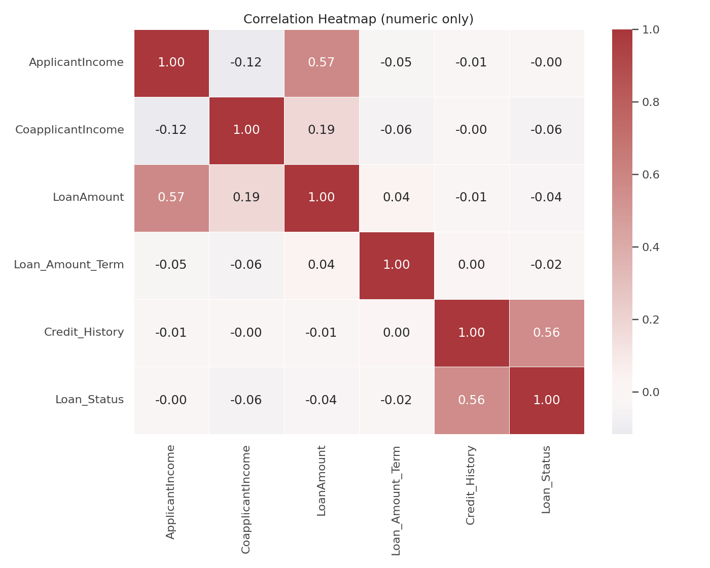
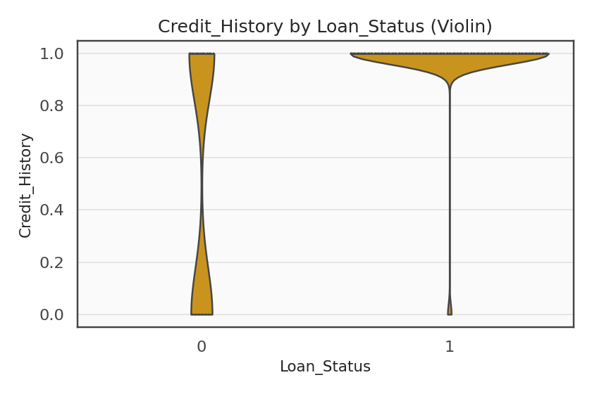
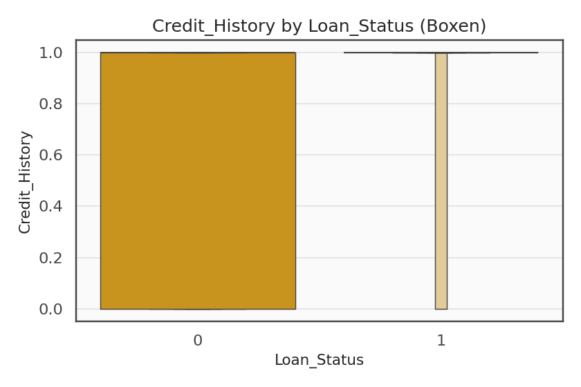

#  Loan Repayment Behaviour Analytics 

*A 21-day analytical journey — from open loan-repayment data to explainable, fair, and actionable insights.*

---

##  Overview

Late repayments often indicate financial stress or disengagement. 

Every repayment tells a story — of confidence, hardship, or opportunity.  
This project transforms open loan-repayment data into **evidence-based insights** that help financial and government organisations engage customers early, fairly, and effectively.

It’s about understanding **why people repay**, **how trust is built**, and **how data can be used responsibly** to support them.

This project explores open loan-repayment data to uncover factors that separate on-time payers from those who default.  
The goal is to build interpretable, fair predictive models — inspired by **customer-centric philosophy** of early intervention and supportive engagement.

---

##  Objective

Conduct advanced analysis of open loan-repayment data to identify **transparent, fair, and actionable** patterns in repayment behaviour.  
The insights will help design ethical, data-driven outreach strategies aligned with Inland Revenue’s values of fairness, empathy, and compliance.

---
##  Project Flow - From Data to Decisions

| Phase |  Key Focus | Deliverables | Output |
|:--|:--|:--|:--|
| 1 | **Setup & Planning** | Create repo, folder structure, utils, and documentation |  `README.md`, `utils_paths.py` |
| 2 | **Data Intake & Cleaning** |  Consolidated and validated open loan data (600+ records) | `loan_data_clean_start.csv` |
| 3 | **Exploratory Data Analysis** | Mapped patterns of income, credit history, and default | [ EDA Explained Report ](docs/EDA_Explained.md) |
| 4 | **Feature Engineering** |  Derived indicators for income comfort, EMI ratio, and payment resilience | `loan_features.csv`, feature dictionary |
| 5 | **Modelling (Planned)** | Logistic Regression & Random Forest with SHAP-based explainability | `04_model_baselines.ipynb` |
| 6 | **Explainability & Fairness (Planned)** | Power BI storytelling dashboard for decision-maker|

---

##  Updated 21-Day Schedule (Progress → Feature Engineering)

| Day Range | Focus Area | Deliverables | Status |
|:--|:--|:--|:--|
| **1-2** | Repository setup, `.gitignore`, project board, utils | Base repo live + paths configured |  Done |
| **3-4** | Data acquisition & intake | Clean CSV, missing-value analysis |  Done |
| **5-7** | Exploratory Data Analysis | Distributions, correlations, fairness snapshot |  Done |
| **8-9** | Feature design | Income-loan ratio, EMI, balance-income, bins |  In Progress |
| **10** | Feature validation + export | Feature dictionary + ready CSV |  Pending |

---

##  Headline Insights  

> **Credit History is Destiny, but Income Comfort Builds Confidence.**

| Factor | What We Learned | What It Means |
|:--|:--|:--|
| **Credit History** | ~80 % approval for clean records, ~20 % for poor ones | Trust is the strongest currency in lending. |
| **Income-to-Loan Ratio** | Better predictor than income alone | Sustainable affordability beats raw wealth. |
| **Property Area** | Semi-urban borrowers most consistent | Economic balance drives repayment stability. |
| **Demographics** | Gender and education differences < 5 % | Lending patterns are largely fair and inclusive. |

---

##  Visual Storytelling  

  
  
  

**Figure:**  
(1) Correlations show credit history as the most influential factor.  
(2) Violin plots reveal distribution of repayment probability.  
(3) Boxen plots highlight variability between risk groups.

---

## ️ Analytical Backbone  

| Concept | Formula | Role in the Analysis |
|:--|:--|:--|
| **Approval Rate** | $\hat{p}=x/n$ | Quantifies success ratio within each borrower segment. |
| **Confidence Interval** | $\hat{p}\pm1.96\sqrt{\hat{p}(1-\hat{p})/n}$ | Measures reliability of observed rates. |
| **Correlation** | $r_{XY}=\mathrm{Cov}(X,Y)/(\sigma_X\sigma_Y)$ | Evaluates feature influence on repayment. |
| **Fairness Gap** | $\Delta_{AB}=|\hat{p}_A-\hat{p}_B|$ | Tests equity across customer subgroups. |

These metrics ground the visuals in statistical credibility — every conclusion is testable and traceable.

---

##  Key insights  

- **For Financial Institutions:** Identify early signs of payment stress and offer tailored repayment pathways.  
- **For Policymakers:** Track fairness in credit access and outcomes to maintain trust in public programmes.  
- **For Data Teams:** Build interpretable, bias-aware models that align with both performance and equity.  
- **For Citizens:** Transparent analytics that explain *why* decisions are made — not just *what* decisions are made.

---

##  Full Analytical Report  

- [Read the complete EDA report ](docs/EDA_Explained.md)  
- [Feature Engineering Explained](docs/Feature_Engineering_Explained.md)
Includes detailed visuals, formula explanations, and fairness analysis.

---
##  Next Steps (Feature Engineering)

1. **Derive new behavioural features**  
   - `IncomeToLoanRatio`, `BalanceIncome`, `EMI`, `FamilySize`
2. **Create categorical bands**  
   - Income bands, Loan amount bands, and Term bands for interpretability
3. **Validate feature distributions**  
   - Ensure no negative or skewed features distort models
4. **Save processed dataset**  
   - `loan_features.csv` in `/data/processed/`

---

##  Author  

**Madhuri Mapari**  
*Data & AI Specialist — blending analytics, fairness, and storytelling to power responsible decisions.*

---

*Updated October 2025 • Part of the Loan Repayment Behaviour Analytics Project*
