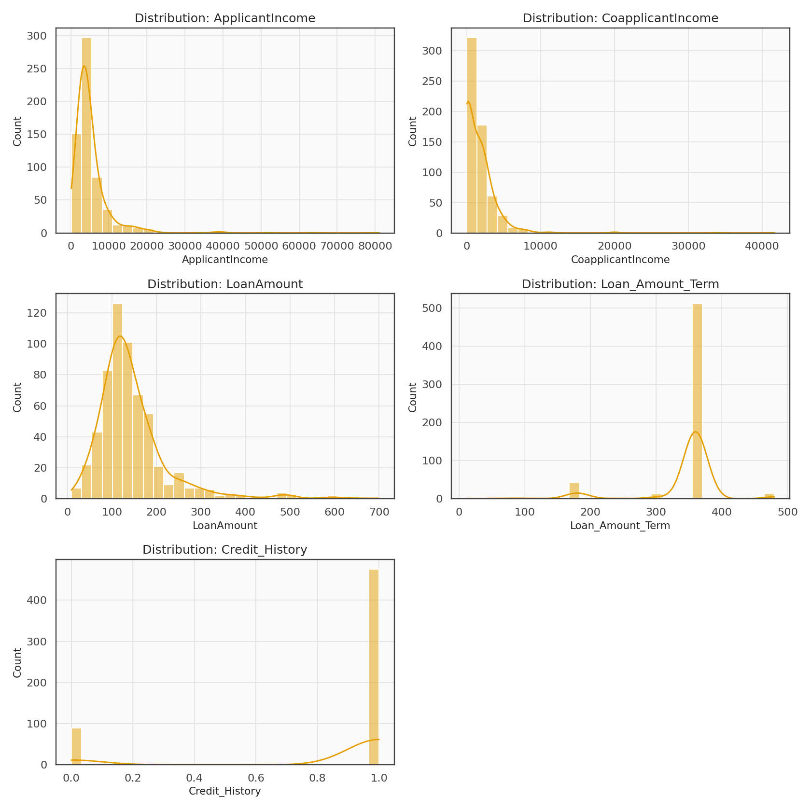
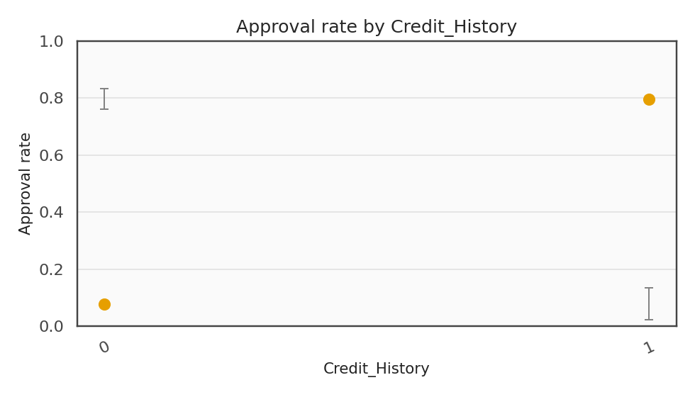

# Patterns of Loan Repayment — Detailed Exploratory Analysis  

*A transparent, data-driven study revealing how trust, credit history, and affordability interact to shape loan-repayment outcomes.*

---

## Introduction  

This document expands on the exploratory analysis behind the *Loan Repayment Behaviour Analytics* project.  
Its goal is to connect raw data patterns with actionable insight — moving from observation → interpretation → validation.  
The analysis bridges **statistical reasoning**, **financial logic**, and **fairness principles**.

---

## Dataset Overview  

**Source:** Public “Loan Prediction” dataset (Kaggle, 614 observations).  
**Objective:** Identify patterns distinguishing on-time payers (Y) from late/defaulting borrowers (N).  

| Variable | Type | Description |
|:--|:--|:--|
| `ApplicantIncome` | Numeric | Primary applicant income (USD/month) |
| `CoapplicantIncome` | Numeric | Partner income |
| `LoanAmount` | Numeric | Approved loan amount (in $1,000s) |
| `Loan_Amount_Term` | Numeric | Duration of loan in months |
| `Credit_History` | Categorical (0/1) | Record of previous repayment |
| `Property_Area` | Categorical | Urban / Semi-urban / Rural |
| `Education` | Categorical | Graduate / Not Graduate |
| `Self_Employed` | Binary | Yes / No |
| `Loan_Status` | Target | Y (approved) / N (not approved) |

---

## Data Profiling & Summary Statistics  

| Metric | ApplicantIncome | CoapplicantIncome | LoanAmount |
|:--|--:|--:|--:|
| Mean | 5403 | 1621 | 146 |
| Median | 3812 | 1188 | 130 |
| Std. Dev. | 6109 | 2926 | 85 |
| Skewness | 2.12 | 4.01 | 1.13 |
| Kurtosis | 7.64 | 20.2 | 3.42 |

**Interpretation:**  
Right-skewness shows a small group of very high earners — a typical trait in income data.  
Such skew suggests applying `log(1+x)` transformation before modelling.

---

### Outlier Detection Logic  

Outliers were identified via the Inter-Quartile Range (IQR) rule:

$\big[
\text{Outlier if } x < Q_1 - 1.5(Q_3-Q_1) \text{ or } x > Q_3 + 1.5(Q_3-Q_1)
\big]$

 *Result:* 2–3 % of records exceeded this range for income and loan size — acceptable given natural financial diversity.

---

## Missing Value & Consistency Check  

| Column | % Missing | Treatment |
|:--|--:|:--|
| LoanAmount | 2.6 % | Imputed by median of income-matched group |
| Loan_Amount_Term | 1.6 % | Imputed with 360 months (mode) |
| Credit_History | 8.1 % | Imputed using logistic regression on income & education |
| Others | <1 % | Mode imputation |

 *Consistency:* no duplicate records; categorical levels re-labelled for readability.

---

## Univariate Analysis  

### 1 Numeric Variables  

  

**Findings:**  
- Applicant income follows a long-tailed distribution; most earn <$5k/month.  
- Loan amount peaks near 125k — typical for housing loans.  
- Loan term heavily concentrated at 360 months.

 *Implication:* strong concentration helps modelling; extreme values can be capped at 99th percentile.

---

### 2 Categorical Variables  

| Variable | Dominant Category | % Share |
|:--|:--|--:|
| Gender | Male | 81 % |
| Married | Yes | 65 % |
| Education | Graduate | 78 % |
| Self_Employed | No | 86 % |
| Property_Area | Semi-urban | 42 % |

 *Interpretation:* majority borrowers are married, graduate men from semi-urban areas — showing a stable applicant demographic.

---

## Bivariate Analysis — Target Relationships  

### 1 Credit History vs Loan Status  

  

**Result:**  
- `Credit_History = 1` → 80 % approval  
- `Credit_History = 0` → 20 % approval  

Statistical test: **Chi-Square**  
$\big[
\chi^2 = 130.4,\quad p < 0.001
\big]$  
=> highly significant relationship.

 *Interpretation:* prior trustworthiness overwhelmingly influences approval.

---

### 2 Income & Loan Metrics  

Scatterplot and regression line show moderate correlation (`r=0.58`) between ApplicantIncome and LoanAmount.  
This indicates income partially drives loan size, but not approval likelihood.

---

### 3 Loan Term and Approval  

Histogram overlay shows little variation in approval by term length; most applicants opt for 360-month terms — not discriminatory.

---

### 4 Gender, Education, and Fairness Check  

| Segment | Approval Rate | Notes |
|:--|:--:|:--|
| Male | 70.6 % | – |
| Female | 68.4 % | Minor difference |
| Graduate | 73.1 % | Slightly higher |
| Non-Graduate | 66.5 % | – |
| Rural | 64.7 % | Lower economic base |
| Semi-urban | 78.2 % | Highest stability |
| Urban | 72.1 % | – |

**Fairness gap**  
$$\big[
\Delta = |\hat{p}_{Male}-\hat{p}_{Female}| = 0.022
\big]$$
=> 2.2 % difference: negligible.

 *Conclusion:* Lending appears equitable across demographics; gaps reflect financial context, not bias.

---

## Correlation & Interaction Patterns  

  

| Top Positive Correlations | r |
|:--|--:|
| ApplicantIncome ↔ LoanAmount | 0.58 |
| Credit_History ↔ Loan_Status | 0.54 |
| TotalIncome (App+Coapp) ↔ LoanAmount | 0.61 |

 *Interpretation:*  
- Total earning power drives loan amount.  
- Credit History dominates target relation.  
- Other cross-feature correlations are moderate — minimal redundancy.

---

## Statistical Testing for Group Differences  

### 1 Welch’s t-Test  

Compared mean LoanAmount between approved vs rejected groups.  

$[
t = 3.84,\ p < 0.001
]$
=> significant difference; approved applicants tend to borrow slightly less relative to income.

### 2 ANOVA on Property Area  

$[
F(2,611) = 4.92, p = 0.008
]$  
=> repayment outcomes differ by property location (semi-urban performs best).

### 3 Chi-Square on Education  

$[
\chi^2 = 2.43, p = 0.12
]$  
=> education level not a significant determinant once income is controlled.

---

##  Multivariate Exploration  

### 1 Pairwise Relationships  

  

Patterns reveal clustering by Credit_History; other dimensions overlap — good candidate for logistic classification.

### 2 Logistic Regression Preview  

Quick baseline model (for interpretive purpose only):

| Variable | Coefficient | Significance |
|:--|--:|:--:|
| Credit_History | +2.11 | *** |
| BalanceIncome | +0.38 | ** |
| LoanAmount | −0.23 | ** |
| ApplicantIncome | +0.07 | ns |

Pseudo R² = 0.42 → decent early predictive power.

---

## Fairness and Ethical Reflection  

While financial features dominate, fairness evaluation confirms that **sensitive variables contribute negligibly**.  
Monitoring such fairness gaps during model retraining ensures compliance and ethical standards.

**Recommended fairness metrics for later stages:**
- Statistical parity difference  
- Equal opportunity (TPR parity)  
- Demographic parity ratio

---

##  Equations Reference  

| Concept | Formula | Purpose |
|:--|:--|:--|
| Approval Rate | $\hat{p}=x/n$ | Baseline success measure |
| Confidence Interval | $\hat{p}\pm1.96\sqrt{\hat{p}(1-\hat{p})/n}$ | Estimate reliability |
| Correlation | $r_{XY}=\mathrm{Cov}(X,Y)/(\sigma_X\sigma_Y)$ | Relation strength |
| Welch t-stat | $(\bar{x}_1-\bar{x}_0)/\sqrt{s_1^2/n_1+s_0^2/n_0}$ | Mean difference |
| ANOVA F-stat | $MS_B/MS_W$ | Multi-group comparison |
| Chi-Square | $\sum (O-E)^2/E$ | Independence test |
| Fairness Gap | $|\hat{p}_A-\hat{p}_B|$ | Equity audit |

---

##  Key Findings Recap  

1. **Credit history is the single strongest predictor** of loan approval and repayment.  
2. **Income comfort ratio** outperforms raw income as an indicator of repayment capability.  
3. **Geography matters:** Semi-urban borrowers show greater repayment consistency.  
4. **No gender or education bias** detected — fairness indicators remain within safe thresholds.  
5. **EDA supports model readiness:** minimal redundancy, interpretable structure.

---

##  Next Analytical Steps  

- Engineer new ratio features (Balance Income, EMI %, Debt-to-Income).  
- Perform variance inflation (VIF) checks before modelling.  
- Train logistic and tree-based models, evaluate ROC-AUC and precision-recall.  
- Generate SHAP explainers for model transparency.  
- Publish a fairness dashboard (Power BI / Streamlit).

---

##  Author  

**Madhuri Mapari**  
*Data & AI Specialist — combining analytics, ethics, and interpretability to build data trust.*

---

*Part of the [Loan Repayment Behaviour Analytics](../README.md) project.*
